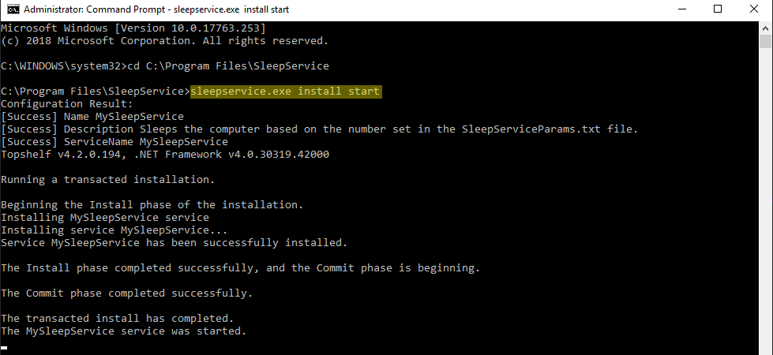

# Sleep Service
This application was written to automatically put my PC to sleep during a certain time. I have it set from 10:00 PM to 8:00 AM the next day.

## Code Details
Built using C# .Net, 4.6 Framework  
Visual Studio 2017 V15.9.5

## Install/Uninstall Instructions
### Install
1. Open SleepServiceParams.txt and **Change Values**.
```
Start Time Hours, Minutes  
22, 00  
End Time Hours, Minutes  
08, 00
```
2. Open **Command Prompt (Admin)**
3. **Change Directory** to the file location where Sleep Service is located.  
     example: `cd "C:\Users\USERNAME\SleepService"`
4. **Type** `sleepservice.exe install start`


### Uninstall
Same as install step 1-3, **step 4 type** `sleepservice.exe uninstall`

## Updates
#### 1.0.1 & 1.0.2 ####
If currentTime is after midnight, The startTime & endTime will be for the current day.  
**Example**: startTime = 1/1 10:00 PM, endTime = 1/2 8:00 AM. When currentTime clicks midnight on 1/2, both times will add 1 day. Now remove that day for the new check and see if currentTime fits in that range
#### 1.0.3 ####
Syntax error where GetIdleTime.Seconds was greater then 15, should have been minutes.  
Added a LastWake DateTime to check when computer was last woken up. Idle Time && LastWake time must both be greather than or equal to 15 minutes.
#### 1.0.4 ####
Added SleepWaitTimer for common variable time & SleeperCounter to count how many times the _timer elapsed, then it disposes and re initializes.
Change the GetIdleTime, bootTime & lastInputTime to Now from UtcNow so that it does the correct math.
Other minor debug changes
#### 1.0.5 ####
Fixed error for Time after midnight. Added startTime2 & endTime2.
Moved all start & end time from file to it's own method.
Changed some debug formatting.